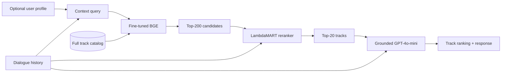
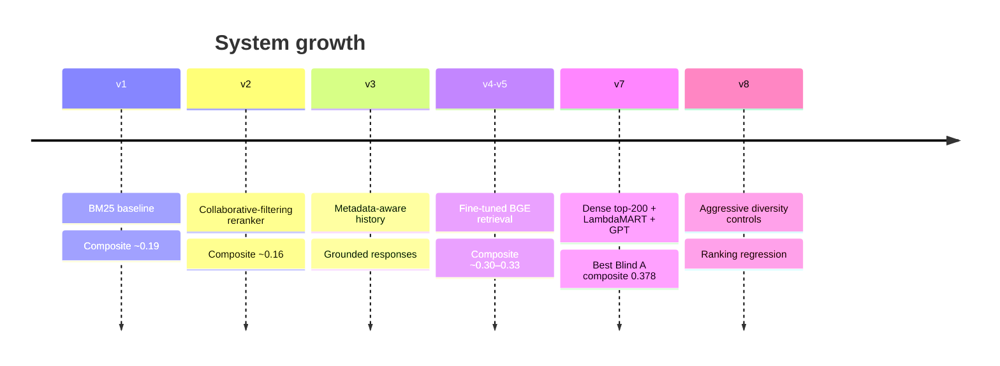

# Music-CRS 2026 — Team tahamoula

> Fine-tuned dense retrieval, learning-to-rank, and grounded generation for the  
> **ACM RecSys Challenge 2026: Conversational Music Recommendation**.

[](https://www.recsyschallenge.com/2026/)
[](https://www.python.org/)
[](https://pytorch.org/)
[](https://lightgbm.readthedocs.io/)

**[Official challenge](https://www.recsyschallenge.com/2026/)** ·
**[Music-CRS website](https://nlp4musa.github.io/music-crs-challenge/)** ·
**[Final leaderboard](https://nlp4musa.github.io/music-crs-challenge/results.html)** ·
**[Datasets](https://huggingface.co/collections/talkpl-ai/talkplay-data-challenge)**

This repository documents Team **tahamoula's** full competition workflow:
baseline experiments, dense-retriever training, LambdaMART reranking, response
generation, evaluation, Colab instructions, and the unsuccessful experiments
that informed the final system.

## Final system



1. **Dense retrieval** — a fine-tuned `BAAI/bge-small-en-v1.5` encoder retrieves
   200 candidates from the complete track catalog.
2. **Learning to rank** — a LightGBM LambdaRank model reranks candidates for
   nDCG@20 and selects the final 20 tracks.
3. **Response generation** — GPT-4o-mini writes a response grounded in metadata
   for the highest-ranked tracks.

For Blind B cold-start users, the pipeline skips missing profile signals and
falls back to dialogue semantics and track metadata.

## Results

| Evaluation split | System | Composite | nDCG@20 | LLM judge | Catalog diversity |
|---|---|---:|---:|---:|---:|
| Blind A | **v7 champion** | **0.378** | **0.298** | **3.05** | **0.031** |
| Blind B | v7 cold-start submission | **0.29** | Hidden at submission time | Hidden | Hidden |

The official composite is:

```text
0.50 × nDCG@20
+ 0.10 × catalog diversity
+ 0.10 × lexical diversity
+ 0.30 × normalized LLM judge
```

## Evolution



| Version | What changed | Main lesson |
|---|---|---|
| v1 | BM25 + Llama baseline | Keyword matching had a semantic ceiling. |
| v2 | Collaborative-filtering reranking | Historical affinity could conflict with the latest request. |
| v3 | Metadata-aware dialogue history and grounded replies | Better context was useful, but retrieval remained the bottleneck. |
| v4–v5 | BGE fine-tuning | Semantic candidate retrieval produced the largest retrieval gain. |
| **v7** | Dense pool → LambdaMART → GPT-4o-mini | Best balance of ranking and response quality. |
| v8 | Global diversity masking and extra features | Diversity gains were not worth the loss in relevance. |
| Hybrid | BM25 + dense RRF with a 1,000-track pool | More candidates did not automatically improve top-20 precision. |

## Repository guide

```text
.
├── README.md                    # You are here
├── docs/
│   └── COLAB.md                 # End-to-end Colab runbook
├── notebooks/
│   └── blind-a-inference.ipynb  # Historical Blind A notebook
├── scripts/
│   ├── pack_colab_zips.sh       # Build clean Colab upload archives
│   └── legacy/                  # Early local inference runners
├── music-crs-baselines/         # Models, configs, training, and inference
└── music-crs-evaluator/         # Development evaluation and diagnostics
```

### Start here

| Goal | Location |
|---|---|
| Understand the architecture and experiments | [`music-crs-baselines/README.md`](music-crs-baselines/README.md) |
| Run the project on Colab | [`docs/COLAB.md`](docs/COLAB.md) |
| Browse experiment configs | [`music-crs-baselines/config/`](music-crs-baselines/config/) |
| Train the dense retriever | [`train_dense_retriever.py`](music-crs-baselines/train_dense_retriever.py) |
| Train LambdaMART | [`train_lambdamart.py`](music-crs-baselines/train_lambdamart.py) |
| Run blind inference | [`run_inference_blindset.py`](music-crs-baselines/run_inference_blindset.py) |
| Evaluate development predictions | [`music-crs-evaluator/`](music-crs-evaluator/) |

## Quick start

```bash
git clone https://github.com/tmoula/2026-ACM-RecSys-Challenge.git
cd 2026-ACM-RecSys-Challenge/music-crs-baselines

python -m venv .venv
source .venv/bin/activate
pip install --upgrade pip
pip install -e .
```

Set only the credentials required by your selected configuration:

```bash
cd ..
cp .env.example .env
# Edit .env locally. Never commit it.
```

Large model checkpoints and generated caches are intentionally excluded from
Git. See the [detailed baseline documentation](music-crs-baselines/README.md)
for expected artifact paths and reproduction commands.

## Build Colab archives

```bash
./scripts/pack_colab_zips.sh
```

Generated archives are written under `artifacts/colab/` and ignored by Git.

## Challenge task

Given a multi-turn conversation and an optional user profile, each system must
produce:

- a ranked list of 20 valid track IDs from the challenge catalog; and
- a natural-language response explaining the recommendations.

The repository always retrieves from `all_tracks`; it does not restrict
candidate generation to a test-only subset.

## Reproducibility notes

- Blind-set ground truth and the official LLM judge are not available locally.
- A blind archive must contain exactly one `prediction.json`.
- Blind A and Blind B each contain 80 target rows.
- Blind B includes 40 cold-start rows whose `user_id` must remain null.
- Generated predictions, checkpoints, caches, virtual environments, and ZIP
  archives are excluded from version control.

## Resources

- [ACM RecSys Challenge 2026](https://www.recsyschallenge.com/2026/)
- [ACM RecSys challenge overview](https://recsys.acm.org/recsys26/challenge/)
- [Music-CRS challenge website](https://nlp4musa.github.io/music-crs-challenge/)
- [Final results](https://nlp4musa.github.io/music-crs-challenge/results.html)
- [Official Music-CRS baselines](https://github.com/nlp4musa/music-crs-baselines)
- [Official evaluator](https://github.com/nlp4musa/music-crs-evaluator)
- [TalkPlayData challenge collection](https://huggingface.co/collections/talkpl-ai/talkplay-data-challenge)

## Acknowledgements

This work builds on the official Music-CRS baseline and evaluation repositories.
Thanks to the challenge organizers and the TalkPlayData authors for providing
the task, datasets, metadata, and evaluation infrastructure.
