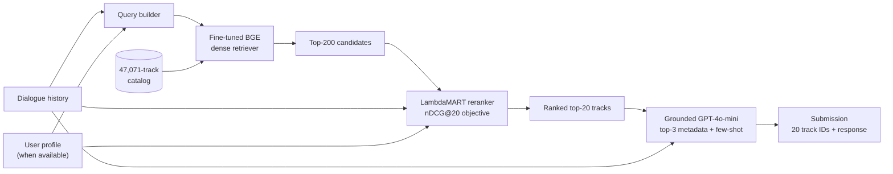
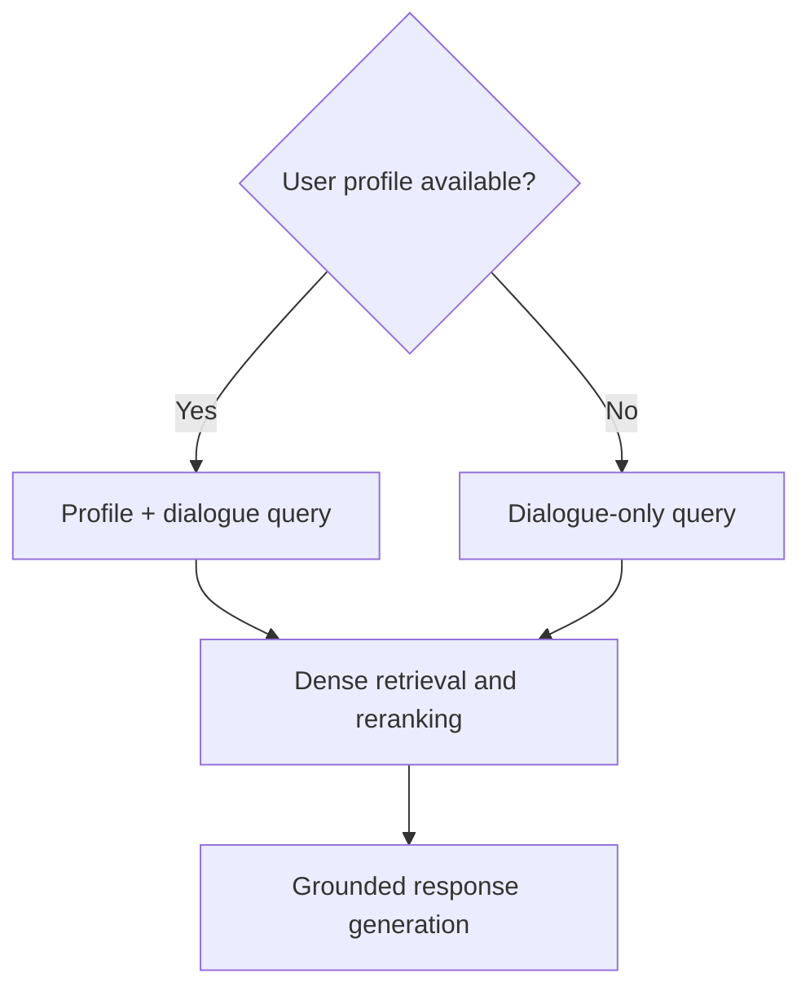
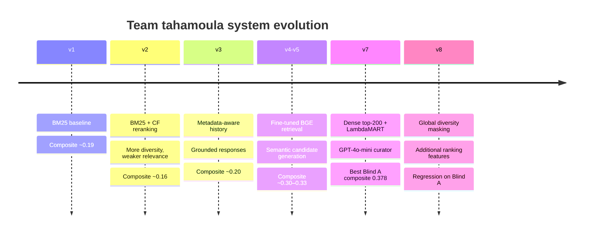

# Music-CRS 2026 — Team tahamoula

> A multi-stage conversational music recommender built for the  
> **ACM RecSys Challenge 2026: Conversational Music Recommendation**.

[](https://www.python.org/)
[](https://pytorch.org/)
[](https://lightgbm.readthedocs.io/)
[](https://www.recsyschallenge.com/2026/)

### Competition links

**[Official challenge page](https://www.recsyschallenge.com/2026/)** ·
**[Music-CRS website](https://nlp4musa.github.io/music-crs-challenge/)** ·
**[Final leaderboard](https://nlp4musa.github.io/music-crs-challenge/results.html)** ·
**[ACM RecSys challenge overview](https://recsys.acm.org/recsys26/challenge/)** ·
**[Datasets](https://huggingface.co/collections/talkpl-ai/talkplay-data-challenge)**

This repository contains Team **tahamoula's** experiments, training tools, inference
pipeline, and competition configs for the Music-CRS challenge. The final system
combines:

1. a fine-tuned **BGE dense retriever**;
2. a **LambdaMART** learning-to-rank stage; and
3. grounded **GPT-4o-mini** response generation.

The project started from the
[official Music-CRS baselines](https://github.com/nlp4musa/music-crs-baselines)
and grew through several retrieval, reranking, generation, and diversity
experiments.

> [!NOTE]
> This is a competition research repository, not the official challenge
> implementation. Official resources are linked in [Resources](#resources).

---

## Results at a glance

Our strongest public Blind A submission was **v7**.

| Split | System | Composite | nDCG@20 | LLM judge | Catalog diversity | Lexical diversity |
|---|---|---:|---:|---:|---:|---:|
| Blind A | **v7 champion** | **0.378** | **0.298** | **3.05** | **0.031** | ~0.72 |
| Blind B | v7 cold-start submission | **0.29** | Hidden | Hidden | Hidden | Hidden |

Blind B contained 80 dialogues, including **40 cold-start users** without a
user ID or profile. Only its composite score was visible when this repository
was prepared, so no per-metric Blind B values are inferred or fabricated here.

### Why catalog-diversity values look small

The challenge computes:

```text
catalog diversity = unique recommended tracks / catalog size
```

For an 80-row blind set with 20 recommendations per row and a 47,071-track
catalog, the maximum is approximately:

```text
1,600 / 47,071 = 0.034
```

The v7 value of `0.031` therefore covers about 91% of the maximum number of
unique recommendation slots available on Blind A.

---

## System architecture



### Stage 1 — semantic candidate retrieval

- Base encoder: [`BAAI/bge-small-en-v1.5`](https://huggingface.co/BAAI/bge-small-en-v1.5)
- Fine-tuned checkpoint: `bge-talkplay-v5-bs32`
- Training objective: in-batch contrastive learning
- Query context: dialogue history plus user profile when available
- Candidate pool: top 200 tracks from `all_tracks`

Dense retrieval replaced the lexical ceiling of the early BM25 systems. It can
connect requests such as “moody but not sad” with track metadata even when the
same words are not present.

### Stage 2 — learning to rank

The v7 ranker uses LightGBM's LambdaRank objective to reorder the dense candidate
pool for nDCG@20. Features combine retrieval rank and score signals with
dialogue-, metadata-, profile-, and popularity-derived signals.

The repository also contains later experimental rankers and feature builders:

- LambdaMART (`mcrs/reranker_modules/lambdamart_reranker.py`)
- LightGBM pointwise reranking
- embedding and cross-encoder rerankers
- dense/BM25 reciprocal-rank fusion
- collaborative-filtering retrieval

### Stage 3 — grounded conversational response

The final generator is GPT-4o-mini in `gpt_curator` mode. It receives metadata
for the top three ranked tracks and two dynamically selected few-shot examples.
This keeps explanations tied to real recommendations while improving
personalization and language quality.

### Cold-start behavior

When `user_id` is missing, the pipeline does not manufacture a profile:



Profile-dependent features are skipped for cold-start users; dialogue semantics,
retrieval scores, and track metadata remain available.

---

## How the system evolved



| Version | Main change | Outcome / lesson |
|---|---|---|
| **v1** | Official-style BM25 retrieval + Llama response | Reliable baseline, but sparse matching missed semantic intent. |
| **v2** | Added collaborative-filtering reranking | Diversity improved, but user-history signals overrode the current request. |
| **v3** | Converted music turns to metadata; grounded longer responses | Better context and explanation quality, but retrieval remained the bottleneck. |
| **v4** | Fine-tuned BGE from the base checkpoint (batch 16) | Major semantic-retrieval improvement; Blind A composite reached ~0.302. |
| **v5** | Fine-tuned BGE from base with batch 32 | Strongest dense checkpoint; used by the final system. |
| **v6** | Continued fine-tuning from an older checkpoint | Overfit and generalized worse; training longer was not automatically better. |
| **v7** | Dense top-200 → LambdaMART → GPT-4o-mini | **Best public system:** 0.378 Blind A composite. |
| **v8** | Aggressive global diversity + extra rank features | Diversity increased, but nDCG fell; relevance should not be traded away blindly. |
| **Hybrid** | BM25 + dense RRF, pool 1,000, retrained LambdaMART | Useful research branch, but it did not beat the simpler v7 stack on Blind A. |

The central lesson was that **candidate quality first, precision reranking
second, response quality third** produced more reliable gains than adding
complexity everywhere at once.

---

## Repository map

```text
music-crs-baselines/
├── config/                         # Reproducible experiment YAMLs
├── mcrs/
│   ├── db_item/                    # Track metadata access
│   ├── db_user/                    # User-profile access
│   ├── lm_modules/                 # Llama and OpenAI generators
│   ├── retrieval_modules/          # BM25, dense, hybrid, CF, full-stack
│   ├── reranker_modules/           # LambdaMART, LightGBM, CE, embeddings
│   ├── utils/                      # Conversation, GT, diversity helpers
│   └── crs_baseline.py             # End-to-end pipeline orchestration
├── build_lambdamart_features.py    # Create ranking training data
├── build_fewshot_pool.py           # Build grounded generation examples
├── evaluate_rerank_ndcg_devset.py  # Rerank-only dev evaluation
├── recall_at_k.py                  # Pre-rerank recall diagnostic
├── run_inference_devset.py         # Development-set inference
├── run_inference_blindset.py       # Blind-set inference
├── train_dense_retriever.py        # BGE fine-tuning
└── train_lambdamart.py             # LambdaRank training
```

### Important configs

| Config | Purpose |
|---|---|
| `llama1b_bm25_devset` | Minimal sparse baseline |
| `llama1b_bert_ft_devset` | Fine-tuned dense retrieval |
| `llama1b_lambdamart_devset` | Dense candidate pools for v7 ranking |
| `llama1b_champion_lambdamart_gpt_blindset_A` | Final v7 Blind A pipeline |
| `llama1b_lambdamart_hybrid_pool1000_devset` | Experimental dense + BM25 pool |
| `llama1b_champion_hybrid_pool1000_blindset_A` | Experimental hybrid submission |
| `llama1b_champion_v8_blindset_A` | Diversity experiment; retained for analysis |

---

## Quick start

### Requirements

- Python 3.10+
- CUDA GPU recommended for dense indexing and training
- Hugging Face access for gated models, when using Llama
- OpenAI API key only for GPT-based generation configs

### Install

```bash
git clone https://github.com/tmoula/2026-ACM-RecSys-Challenge.git
cd 2026-ACM-RecSys-Challenge/music-crs-baselines

python -m venv .venv
source .venv/bin/activate
pip install --upgrade pip
pip install -e .
```

Optional optimized attention:

```bash
pip install flash-attn --no-build-isolation
```

> [!IMPORTANT]
> Never commit `.env`, API keys, checkpoints, generated caches, or private
> submission artifacts. The root `.gitignore` excludes environments and caches;
> inspect `git status` before publishing to catch checkpoints or predictions.

### Environment variables

```bash
export HF_TOKEN="..."
export OPENAI_API_KEY="..."  # only needed for GPT configs
```

### Model artifacts

Large trained artifacts are intentionally not versioned:

```text
checkpoints/bge-talkplay-v5-bs32/
cache/reranker/lambdamart_model.txt
cache/generation/fewshot_pool.json
```

Train them using the steps below or place restored copies at these paths.

---

## Reproducing the main pipeline

### 1. Fine-tune the dense retriever

```bash
python train_dense_retriever.py \
  --model-name BAAI/bge-small-en-v1.5 \
  --output-dir ./checkpoints/bge-talkplay-v5-bs32 \
  --epochs 3 \
  --batch-size 32 \
  --learning-rate 2e-5 \
  --max-length 512 \
  --train-split train \
  --val-split test
```

### 2. Diagnose candidate recall

```bash
python recall_at_k.py \
  --tid llama1b_lambdamart_devset \
  --batch-size 16
```

This answers a key question before reranking: *is the ground-truth track already
inside the candidate pool?*

### 3. Build LambdaMART features and train

```bash
python build_fewshot_pool.py

python build_lambdamart_features.py \
  --tid llama1b_lambdamart_devset \
  --max-candidates 200

python train_lambdamart.py \
  --features ./cache/reranker/lambdamart_features.jsonl \
  --output ./cache/reranker/lambdamart_model.txt \
  --num-boost-round 300
```

### 4. Run development inference

```bash
python run_inference_devset.py \
  --tid llama1b_v5_lambdamart_devset \
  --batch_size 4 \
  --keep-cache
```

### 5. Run blind inference

```bash
python run_inference_blindset.py \
  --tid llama1b_champion_lambdamart_gpt_blindset_A \
  --eval_dataset blindset_A \
  --batch_size 1 \
  --keep-cache
```

Outputs are written to:

```text
exp/inference/<split>/<config-name>.json
```

> [!CAUTION]
> A blind submission must contain exactly one prediction per dataset row.
> Validate that Blind A or Blind B contains **80 predictions**, not one newly
> expanded prediction for every historical conversation turn.

---

## Submission format

Each prediction has the following shape:

```json
{
  "session_id": "session-uuid",
  "user_id": null,
  "turn_number": 4,
  "predicted_track_ids": [
    "track-uuid-01",
    "track-uuid-02"
  ],
  "predicted_response": "A concise, grounded recommendation response."
}
```

Rules:

- one row per target dialogue;
- exactly 20 unique, valid track IDs per row;
- preserve `user_id: null` for cold-start users;
- do not invent or backfill private user profiles;
- the archive must contain a file named **`prediction.json`**.

Create a submission archive:

```python
import json
import zipfile
from pathlib import Path

prediction = Path(
    "exp/inference/blindset_A/"
    "llama1b_champion_lambdamart_gpt_blindset_A.json"
)
rows = json.loads(prediction.read_text())
assert len(rows) == 80
assert all(len(row["predicted_track_ids"]) == 20 for row in rows)

with zipfile.ZipFile("submission.zip", "w", zipfile.ZIP_DEFLATED) as archive:
    archive.write(prediction, arcname="prediction.json")
```

---

## Evaluation

The challenge evaluates both the ranked recommendations and the generated text.

| Metric | Meaning |
|---|---|
| **nDCG@20** | Whether the relevant track appears near the top of the ranked list |
| **Catalog diversity** | Unique recommended tracks divided by catalog size |
| **Lexical diversity** | Distinct-2 diversity of generated responses |
| **LLM-as-a-Judge** | Personalization and explanation quality |
| **Composite** | `0.50 × nDCG@20 + 0.10 × catalog diversity + 0.10 × lexical diversity + 0.30 × normalized LLM judge` |

The public evaluator supports development-set scoring:

```bash
git clone https://github.com/nlp4musa/music-crs-evaluator.git ../music-crs-evaluator
```

Blind-set ground truth and judge prompts are hidden. A local Blind B script can
validate format, catalog coverage, lexical diversity, and cold-start handling,
but it cannot reproduce the official nDCG, LLM-judge, or composite score.

---

## Experiments that did not win

Negative results are part of this repository on purpose:

- **CF reranking:** historical user affinity could conflict with the latest
  conversational request.
- **Wider hybrid recall:** more candidates did not guarantee better top-20
  precision.
- **Global diversity masking:** improved catalog coverage while suppressing
  relevant repeated tracks.
- **Continued dense fine-tuning:** starting from an already fine-tuned checkpoint
  overfit more easily than restarting from base BGE.
- **Offline metric optimism:** LambdaMART validation on prebuilt candidate pools
  was not equivalent to full blind end-to-end performance.

These experiments reinforce a practical rule:

```text
measure recall → train reranker → verify end-to-end → spend a blind submission
```

---

## Resources

- [RecSys Challenge 2026](https://www.recsyschallenge.com/2026/)
- [Music-CRS challenge website](https://nlp4musa.github.io/music-crs-challenge/)
- [Music-CRS final leaderboard](https://nlp4musa.github.io/music-crs-challenge/results.html)
- [ACM RecSys 2026 challenge overview](https://recsys.acm.org/recsys26/challenge/)
- [TalkPlayData challenge datasets](https://huggingface.co/collections/talkpl-ai/talkplay-data-challenge)
- [Official baseline repository](https://github.com/nlp4musa/music-crs-baselines)
- [Official evaluator repository](https://github.com/nlp4musa/music-crs-evaluator)
- [Blind A dataset](https://huggingface.co/datasets/talkpl-ai/TalkPlayData-Challenge-Blind-A)
- [Blind B dataset](https://huggingface.co/datasets/talkpl-ai/TalkPlayData-Challenge-Blind-B)
- [Track metadata](https://huggingface.co/datasets/talkpl-ai/TalkPlayData-Challenge-Track-Metadata)
- [User metadata](https://huggingface.co/datasets/talkpl-ai/TalkPlayData-Challenge-User-Metadata)

---

## Acknowledgements

Thanks to the Music-CRS organizers and the authors of TalkPlayData for the
datasets, baseline implementation, evaluator, and challenge infrastructure.

This repository documents Team **tahamoula's** competition journey—including
the successful system and the experiments that helped reveal why it worked.
